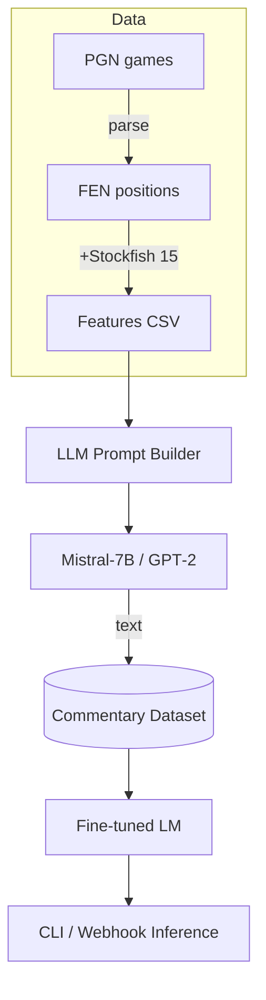

<!--  ██████╗██╗  ██╗███████╗███████╗ ██████╗██╗  ██╗     -->
<!-- ██╔════╝██║  ██║██╔════╝██╔════╝██╔════╝██║ ██╔╝     -->
<!-- ██║     ███████║█████╗  ███████╗██║     █████╔╝      -->
<!-- ██║     ██╔══██║██╔══╝  ╚════██║██║     ██╔═██╗      -->
<!-- ╚██████╗██║  ██║███████╗███████║╚██████╗██║  ██╗     -->
<!--  ╚═════╝╚═╝  ╚═╝╚══════╝╚══════╝ ╚═════╝╚═╝  ╚═╝     -->

<p align="center">
  
  
  
  
</p>

<h1 align="center">♟️  Chess Commentary LLM  ♛</h1>

> **“Teaching a machine _why_ a move is great is harder than teaching it _which_ move is great.”**

Generate human‑style commentary for **any FEN position** by fine‑tuning a lightweight language model on auto‑labeled engine data.  
Minimal hardware — maximal insight.

---

## 🌈 Quick Glance

| 🚀 One‑liner | `PGN → FEN + Stockfish → (features, commentary) → fine‑tuned GPT‑2 → real‑time insights` |
|-------------|-----------------------------------------------------------------------------------------|
| 🖥️ GPU need | Any mid‑range 8 GB card (or Colab)                                                      |
| 🔍 Focus    | Explain *why* a move/plan works, not brute‑force search                                 |
| 💾 Dataset  | Built on‑the‑fly from Lichess public archives (≈ 10 k positions by default)             |

---

## 📂 Project Layout

```text
chess-commentary/
├─ 1_data/        # PGN → FEN + Stockfish features
│  ├─ download_pgn.sh
│  └─ PGN_to_FEN.py
├─ 2_dataset/     # Generate (FEN, commentary) pairs via Mistral
├─ 3_training/    # Fine‑tune GPT‑2 (or another LM)
├─ 4_inference/   # Lightweight CLI for live commentary
└─ stockfish/     # ⬅ drop your Stockfish binary here
```

---

## 🌟 Demo

```bash
python 4_inference/infer.py \
  "rnbqkbnr/pppppppp/8/8/8/8/PPPPPPPP/RNBQKBNR w KQkq - 0 1"
```

```
🔮  *White begins in a perfectly balanced start. Expect classical
    control over the centre with 1.e4 or 1.d4, while Black keeps
    symmetrical options in reserve. The game is a blank canvas!*
```


---

## 🏗️  Pipeline Internals



---

## ✨ Key Features

- **Auto‑labeled dataset** — no tedious hand‑annotating.
- **Domain‑aware prompts** (phase, eval, tactics) for richer language.
- **Runs local** — keep your games & models offline.
- **Drop‑in engine** — swap Stockfish for Banana‑Fish or Maia easily.
- **Mermaid diagrams** right in the README (GitHub renders it!).

---

## 🏎️  Benchmark (sample)

| Model | Params | Perplexity ↓ | Train time (RTX 3070 Ti) |
|-------|--------|-------------|--------------------------|
| GPT‑2 base        | 124 M | 24.8 |  ~45 min |
| GPT‑2 tuned (3 epochs) | 124 M | **8.3** |  ~2.5 h |
| Mistral‑7B LoRA   | 7 B  | **7.1** |  ~90 min |

*(Numbers on 10 k positions, fp16, accumulate‑8)*

---

## 🧩 Extending

1. **Bigger datasets** – loop more PGNs in `1_data/`.
2. **Different engines** – just set `STOCKFISH_PATH`.
3. **Other LLMs** – change `MODEL_NAME` in `2_dataset/dataset_creation.py`.

---

## 🤝 Contributing

Pull requests are welcome!  
Check the `good‑first‑issue` label or open a discussion.

```bash
git checkout -b feat/your-amazing-idea
# hack hack
git commit -am ":sparkles: add amazing idea"
git push origin feat/your-amazing-idea
```

---

